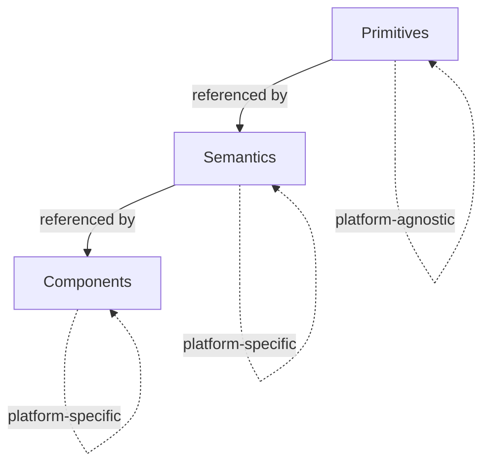

# 3-TIER DESIGN SYSTEM SKILL

## Overview
This skill guides the creation and maintenance of a robust 3-tier design system following the **Primitives → Semantics → Components** architecture. This approach is based on AmbitionBox's design system structure and industry best practices.



| Tier | Purpose | Example |
|------|---------|---------|
| **Primitives** | Raw, atomic values with no context | `Colors.Brand.60` = `#3f5cfb` |
| **Semantics** | Purpose-driven tokens referencing primitives | `Text Color.Primary` = `{Colors.Brand_Neutral.90}` |
| **Components** | UI-specific tokens referencing semantics | `Button.Primary.Bg.Default` = `{Background.Interaction.Primary}` |

---

## TIER 1: PRIMITIVES (Foundation Layer)

### Purpose
Primitives are **raw, context-free design values** that form the foundation of your design system. They should never be used directly in components—they exist solely to be referenced by semantic tokens.

### Key Principles
1. **Hard-coded values only** - No references to other tokens
2. **Numeric scales** - Use consistent numerical patterns (0, 10, 20, 30... or 0, 2, 4, 8, 12...)
3. **Alphabetical/categorical naming** - Use neutral, descriptive names without intent
4. **Platform-agnostic** - Should work across all platforms (Web, Mobile, iOS, Android)

### Structure & Naming Conventions

#### Colors
```
Primitives/Default/
  Colors/
    Brand/
      10, 20, 30, 40, 50, 60, 70, 80, 90, 100
    Grey/
      0, 10, 20, 30, 40, 50, 60, 70, 80, 90, 100
    Brand_Neutral/
      10, 20, 30, 40, 50, 60, 70, 80, 90, 100
    [Color Name]/
      10, 20, 30, 40, 50, 60, 70
```

**Naming Rules:**
- Use **increments of 10** for primary scales (10, 20, 30...)
- **Lower numbers = lighter shades**, **higher numbers = darker shades**
- Include `0` for white in neutrals, `100` for darkest/black
- Color names: Brand, Grey, Brand_Neutral, Blue, Pink, Purple, Teal, Orange, Green, Red, Yellow
- Use **PascalCase with underscores** for multi-word names (e.g., `Brand_Neutral`)

**Scale Guidelines:**
- **10-30**: Very light tints (backgrounds, subtle states)
- **40-60**: Mid-range (interactive elements, icons)
- **70-100**: Dark shades (text, emphasis, dark modes)

**AmbitionBox Color Palette:**
| Color | Steps | Hex Example (50) | Usage |
|-------|-------|------------------|-------|
| `Brand` | 10–100 | `#657dfc` | Primary brand color (blue-purple) |
| `Brand_Neutral` | 10–100 | `#5e6b92` | Brand-tinted neutral for text/backgrounds |
| `Grey` | 0–100 | `#7c7c7c` | Pure neutral scale (0 = white, 100 = black) |
| `Blue` | 10–70 | `#23aae7` | Informational, men-related content |
| `Pink` | 10–70 | `#e62282` | women-related content |
| `Purple` | 10–70 | `#5d23e7` | Premium, special features |
| `Teal` | 10–70 | `#0ac2ab` | Accents, data visualization |
| `Orange` | 10–70 | `#f36b16` | "Bad" rating state |
| `Green` | 10–70 | `#007e3b` | Success, "Good/Excellent" rating |
| `Red` | 10–70 | `#e02020` | Error, "Poor" rating |
| `Yellow` | 10–70 | `#fdad35` | Warning, "Average" rating |

---

#### Typography
```
Primitives/Default/
  Typography/
    Font/
      Family/
        Primary (Figtree), Secondary (Figtree)
      Weight/
        Regular (400), SemiBold (600), Bold (700)
    Size/
      2xs, xs, s, m, ml, l, xl, 2xl, 3xl, 4xl, 5xl, 6xl
    Line Height/
      2xs, xs, s, m, ml, l, xl, 2xl, 3xl, 4xl, 5xl, 6xl
    Letter Spacing/
      2xs, xs, s, m, ml, l
```

**Naming Rules:**
- Use **t-shirt sizing** (xs, s, m, l, xl) or **numerical scales** (2xl, 3xl, 4xl)
- Include `ml` (medium-large) when needed between standard sizes
- Match Line Height scale to Font Size scale for consistency
- Weight names: Regular (400), SemiBold (600), Bold (700)

**AmbitionBox Typography Scale:**
| Token | Value | Use Case |
|-------|-------|----------|
| `2xs` | 10px | Tiny metadata (Meta S) |
| `xs` | 12px | Captions, footnotes (Meta M, Label S) |
| `s` | 14px | Body small, Labels |
| `m` | 16px | Body default (M) |
| `ml` | 18px | Body large, Heading M on mobile |
| `l` | 20px | Heading M on desktop |
| `xl` | 24px | Heading L on mobile |
| `2xl` | 28px | Display S, Heading L on desktop |
| `3xl` | 32px | Display M |
| `4xl` | 48px | Display L |
| `5xl` | 52px | Hero text |
| `6xl` | 60px | Marketing headlines |

**Letter Spacing Scale:**
| Token | Value | Use Case |
|-------|-------|----------|
| `2xs` | -0.4 | Tight tracking for large display |
| `xs` | -0.2 | Slight tightening |
| `s` | 0 | Default |
| `m` | 0.2 | Slight opening |
| `ml` | 0.4 | Open tracking (ALL CAPS) |
| `l` | 0.8 | Expanded for all-caps labels |

---

#### Spacing
```
Primitives/Default/
  Spacing/
    0, 2, 4, 8, 12, 16, 20, 24, 32, 40, 48, 64
```

**Naming Rules:**
- Use **multiples of 4 or 8** for consistency
- Start at 0, include common increments
- Values represent pixels/points

---

#### Border Radius
```
Primitives/Default/
  Border Radius/
    0, 2, 4, 8, 12, 16, 20, Full (9999)
```

**Naming Rules:**
- Use **even numbers** in increments of 4
- Include `0` for sharp corners
- Include `Full` (9999px) for pill shapes

---

#### Stroke Width
```
Primitives/Default/
  Stroke Width/
    0, 1, 2, 4
```

---

#### Icon Sizes
```
Primitives/Default/
  Icon/
    xs (12), s (16), sm (18), m (20), l (24), xl (32)
```

---

#### Opacity
```
Primitives/Default/
  Opacity/
    0, 4%, 8%, 16%, 24%, 32%, 48%, 64%
```

---

## TIER 2: SEMANTICS (Context Layer)

### Purpose
Semantic tokens **give meaning and intent** to primitive values. They bridge the gap between raw values and real-world use cases. This is where design decisions become explicit and maintainable.

### Key Principles
1. **Always reference primitives** - Never use hard-coded values
2. **Describe purpose, not appearance** - Name by function, not value
3. **Platform-specific variants** - Create separate sets for Mobile/Desktop when needed
4. **Theming-ready** - Structure to support light/dark modes

### Token Set Organization
```
Semantics/Mobile/   ← Mobile-specific semantic tokens
Semantics/Desktop/  ← Desktop/Web-specific semantic tokens
```

> [!IMPORTANT]
> **Primitives are platform-agnostic.** Only Semantics and Components should have platform variants.

---

### Categories & Structure

#### Rating Colors (AmbitionBox-specific)
```
Semantics/[Platform]/
  Rating/
    Excellent      → {Colors.Green.60}
    Good           → {Colors.Green.50}
    Average        → {Colors.Yellow.50}
    Bad            → {Colors.Orange.50}
    Poor           → {Colors.Red.50}
    Low Confidence → {Colors.Grey.30}
    ReviewCardCategories → {Colors.Brand_Neutral.50}
```

---

#### Background Colors
```
Semantics/[Platform]/
  Background/
    PageLegacy           → {Colors.Grey.0}
    PageNew              → {Colors.Grey.10}
    Interaction/
      Primary            → {Colors.Brand.60}
      Secondary          → {Colors.Grey.0}
```

**Naming Rules:**
- Group by **context** (Page, Surface, Interaction, Feedback)
- Use **hierarchy levels** (Primary, Secondary, Tertiary)
- Reference primitives: `{Colors.Brand.60}` or `{Colors.Grey.10}`

---

#### Text Colors
```
Semantics/[Platform]/
  Text Color/
    Primary              → {Colors.Brand_Neutral.90}
    Secondary            → {Colors.Brand_Neutral.70}
    Tertiary             → {Colors.Brand_Neutral.50}
    Disabled             → {Colors.Grey.40}
    Brand                → {Colors.Brand.60}
    Error                → {Colors.Red.50}
    Success              → {Colors.Green.50}
    Warning*             → {Colors.Yellow.70}
    Inverse Primary      → {Colors.Grey.0}
    Inverse Secondary    → {Colors.Grey.20}
    Inverse Tertiary     → {Colors.Grey.30}
```

**Naming Rules:**
- Hierarchy: Primary (highest contrast), Secondary, Tertiary, Disabled
- **Inverse** for text on dark backgrounds
- Align with feedback states (Error, Success, Warning)

---

#### Border Colors
```
Semantics/[Platform]/
  Border Color/
    Divider-Light       → {Colors.Grey.20}
    Divider-Dark        → {Colors.Grey.30}
    Container-Light     → {Colors.Grey.20}
    Container-Dark      → {Colors.Grey.30}
    Field-Default       → {Colors.Grey.20}
    Field-Active        → {Colors.Brand.60}
    Field-Error         → {Colors.Red.50}
    Field-Disabled      → {Colors.Grey.20}
    Decorative-Light    → {Colors.Grey.20}
```

**Naming Rules:**
- **Category-Intensity**: Divider-Light, Container-Dark
- **Element-State**: Field-Default, Field-Active, Field-Error
- Include **state variants**: Default, Active, Error, Disabled

---

#### Surface Colors (Backgrounds for states/feedback)
```
Semantics/[Platform]/
  Surface/
    Default      → {Colors.Grey.0}
    Disabled     → {Colors.Grey.10}
    Excellent    → {Colors.Green.10}
    Good         → {Colors.Green.10}
    Average      → {Colors.Yellow.10}
    Bad          → {Colors.Orange.10}
    Poor         → {Colors.Red.10}
    Table        → {Colors.Brand.10}
    Men*         → {Colors.Blue.10}
    Women*       → {Colors.Pink.10}
    Highlight*   → {Colors.Brand.20}
```

---

#### Semantic Border Radius
```
Semantics/[Platform]/
  Border Radius/
    None      → {Border Radius.0}
    Subtle    → {Border Radius.2}
    Standard  → {Border Radius.4}
    Medium    → {Border Radius.8}
    Large     → {Border Radius.12}
    XLarge    → {Border Radius.16}
    XXLarge   → {Border Radius.20}
    Full      → {Border Radius.Full}
```

**Naming Rules:**
- Use **descriptive names** instead of numbers at semantic level
- Reference primitives: `{Border Radius.8}`

---

#### Semantic Stroke Weight
```
Semantics/[Platform]/
  Stroke Weight/
    None     → {Stroke Width.0}
    Default  → {Stroke Width.1}
    Strong   → {Stroke Width.2}
    Heavy    → {Stroke Width.4}
```

---

### Text Styles (Semantic Typography)

Text styles combine font properties into composite tokens. AmbitionBox uses these categories:

| Category | Sizes | Weight | Purpose |
|----------|-------|--------|---------|
| **Display** | L, M, S | Bold/SemiBold | Marketing headlines, hero sections |
| **Heading** | L, M, S, XS | SemiBold | Page/section titles |
| **Body** | L, M (Default), S, XS | Regular | Paragraphs, descriptions |
| **Meta** | L, M (normal), M (All Caps), S (normal), S (All Caps) | Regular | Timestamps, counts, metadata |
| **Label** | L, M, S | SemiBold | Buttons, form labels, navigation |

**Naming Pattern:**
```
Text Styles/
  Font Size**/
    Display L (Normal), Display M, Display S
    Heading L, Heading M* (Normal), Heading S, Heading XS
    Body L, Body M (Normal), Body S, Body XS
    Meta L, Meta M, Meta M CAPS, Meta S, Meta S CAPS
    Label L, Label M, Label S
  Line Height/
    [Mirrors Font Size structure]
```

**Conventions:**
- Mark defaults: `Heading M* (Normal)` or `Body M (Normal)`
- Use `(All Caps)` or `CAPS` suffix for uppercase variants
- `*` denotes variants under discussion
- `**` denotes grouped sub-categories

---

### Platform Differences (Mobile vs Desktop)

When values differ between platforms, define them in their respective token sets while keeping the same structure:

| Token | Mobile Value | Desktop Value |
|-------|--------------|---------------|
| `Text Styles.Font Size**.Heading L` | `{Typography.Size.xl}` (24px) | `{Typography.Size.2xl}` (28px) |
| `Text Styles.Font Size**.Heading S` | `{Typography.Size.s}` (14px) | `{Typography.Size.m}` (16px) |
| `Text Styles.Font Size**.Body L` | `{Typography.Size.ml}` (18px) | `{Typography.Size.l}` (20px) |

**Best Practices:**
- Create **separate token sets** for each platform
- Maintain **identical structure** across platforms
- Only differ in **values**, not names

---

## TIER 3: COMPONENTS (Application Layer)

### Purpose
Component tokens are **the most specific** layer, defining exactly how individual UI components look and behave. They should only reference semantic tokens (never primitives).

### Key Principles
1. **Always reference semantics** - Never skip the semantic layer
2. **Component-specific naming** - Clearly identify which component
3. **State variations** - Include all interactive states
4. **Platform variants** - Separate Mobile/Web when behavior differs
5. **Composition over duplication** - Reuse semantic tokens when possible

### Token Set Organization
```
Components/Mobile/  ← Mobile component tokens
Components/Web/     ← Web component tokens
```

---

### Naming Pattern
```
[Component].[Variant].[Property].[State]
```

**Examples:**
```
Button.Primary.Bg.Default    → {Background.Interaction.Primary}
Button.Primary.Text.Default  → {Text Color.Inverse Primary}
Card.Vertical padding        → {Spacing.16}
```

---

### State Naming Conventions
Use **consistent state names** across all components:

| State | Description |
|-------|-------------|
| **Default** | Resting state |
| **Hover** | Mouse over (web only) |
| **hover** | Light hover effect (secondary actions) |
| **Pressed** | Actively being clicked/tapped |
| **pressed** | Light pressed effect (secondary actions) |
| **Focus** | Keyboard focus |
| **Disabled** | Inactive, not interactable |
| **disabled** | Light disabled background |
| **Selected** | Chosen state (tabs, radio, checkbox) |
| **Error** | Invalid/error state |

> [!NOTE]
> AmbitionBox uses **case differentiation** for primary (PascalCase) vs secondary (lowercase) interaction states:
> - `Pressed` = `{Colors.Brand.60}` (strong/primary)
> - `pressed` = `{Colors.Brand.20}` (subtle/secondary)

---

### Component Token Examples

**Button Component:**
```
Components/[Platform]/
  Button/
    Primary/
      Bg/
        Default → {Background.Interaction.Primary}
      Text/
        Default → {Text Color.Inverse Primary}
```

**Global State Tokens:**
```
Components/[Platform]/
  Default   → {Colors.Grey.0}
  Disabled  → {Colors.Grey.10}
  disabled  → {Colors.Grey.0}
  Hover     → {Colors.Brand.60}
  hover     → {Colors.Brand.20}
  Pressed   → {Colors.Brand.60}
  pressed   → {Colors.Brand.20}
```

**Card Component:**
```
Components/Mobile/
  Card/
    Vertical padding → {Spacing.16}

Components/Web/
  Card/
    Vertical padding → {Spacing.20}
```

---

### Platform Differences

**Mobile Considerations:**
- **Larger touch targets** (minimum 44px)
- **No hover states** on touch devices
- **Emphasis on tap states** (Pressed, Active)
- **Slightly tighter padding** (Card: 16px vs 20px)

**Web Considerations:**
- **Hover states** for mouse interaction
- **Focus states** for keyboard navigation
- **Larger padding** for generous spacing (Card: 20px)
- **Tooltips** on hover

---

## TOKEN REFERENCING SYNTAX

### Curly Brace Notation
Use `{Token.Path}` to reference other tokens:

```json
{
  "value": "{Colors.Brand.50}",           // Reference primitive
  "value": "{Background.Interaction.Primary}", // Reference semantic
  "value": "{Button.Primary.Bg.Default}", // Reference component
  "type": "color"
}
```

### Reference Chain Example
```
Primitive: Colors.Brand.60 = #3f5cfb
    ↓
Semantic: Background.Interaction.Primary = {Colors.Brand.60}
    ↓
Component: Button.Primary.Bg.Default = {Background.Interaction.Primary}
```

### Never Skip Layers
❌ **Wrong:**
```
Components/Web/Button/Primary/Bg/Default: {Colors.Brand.60}
```

✅ **Correct:**
```
Components/Web/Button/Primary/Bg/Default: {Background.Interaction.Primary}
```

---

## NAMING BEST PRACTICES

### General Rules
1. **Use PascalCase** for multi-word tokens: `Brand_Neutral`, `Vertical Padding`
2. **Use spaces** in Figma variable names for readability
3. **Be consistent** - if you use "Bg" once, always use "Bg" (not "Background")
4. **Avoid abbreviations** except common ones (Bg, Xs, Xl, L, M, S)
5. **Alphabetize when logical** (Default, Disabled, Hover, Pressed)

### Abbreviation Standards
| Abbrev | Meaning |
|--------|---------|
| **Bg** | Background |
| **L** | Large |
| **M** | Medium |
| **S** | Small |
| **XS** | Extra Small |
| **XL** | Extra Large |
| **2xl, 3xl, 4xl** | Double/Triple/Quadruple Extra Large |

### Avoid These Naming Mistakes
| ❌ Wrong | ✅ Correct |
|----------|-----------|
| `Light Gray`, `Dark Blue` | `Surface.Secondary`, `Background.Primary` |
| `Small Padding` | `Spacing.Compact` or `Spacing.8` |
| Inconsistent: `primaryColor`, `SecondaryColor` | Consistent: `Primary`, `Secondary` |
| Skipping semantic layer | Proper hierarchy: Component → Semantic → Primitive |

### Special Token Annotations
- **`*`** suffix: Tokens under review or discussion (e.g., `Warning*`, `Highlight*`)
- **`**`** suffix: Grouped sub-categories (e.g., `Font Size**`)
- **`(Normal)`** suffix: Default/standard variant (e.g., `Body M (Normal)`)
- **`(All Caps)`** suffix: Uppercase text variant (e.g., `Meta M (All Caps)`)

---

## THEMING & MODES

### Light/Dark Mode Support
Structure semantic tokens to swap easily between themes:

**Light Mode:**
```
Semantics/Light/
  Background/Canvas/Primary: {Colors.Grey.0}      // White
  Surface/Primary: {Colors.Grey.10}               // Light gray
  Text Color/Primary: {Colors.Brand_Neutral.90}   // Dark
```

**Dark Mode:**
```
Semantics/Dark/
  Background/Canvas/Primary: {Colors.Grey.100}    // Black
  Surface/Primary: {Colors.Grey.90}               // Dark gray
  Text Color/Primary: {Colors.Grey.0}             // White (Inverse)
```

---

## MAINTENANCE & GOVERNANCE

### Review Checklist
Before adding new tokens:

- [ ] Does this token already exist?
- [ ] Is it truly needed, or can we reuse existing?
- [ ] Is it at the correct tier?
- [ ] Does it follow naming conventions?
- [ ] Does it reference the appropriate layer?
- [ ] Is it documented?
- [ ] Have you updated all platform variants?

### Token Auditing
Regular audits prevent bloat:

1. **Unused tokens** - Remove if not referenced
2. **Duplicate tokens** - Consolidate similar values
3. **Naming inconsistencies** - Standardize outliers (e.g., `Pressed` vs `pressed`)
4. **Missing documentation** - Add descriptions
5. **Broken references** - Fix circular dependencies

---

## COMMON PITFALLS TO AVOID

### ❌ Anti-Patterns

1. **Skipping the semantic layer**
   - Component tokens should NEVER reference primitives directly
   - Always go through semantics for flexibility

2. **Too many tokens**
   - Don't create a token for every single value
   - Aim for reusability over exhaustive coverage

3. **Inconsistent naming**
   - Mixing conventions (camelCase, PascalCase, kebab-case)
   - Using different terms for same concept (Bg vs Background)

4. **Hard-coded component values**
   - Components must reference semantics
   - Never use `#ffffff` in component layer

5. **Platform-specific primitives**
   - Primitives should be universal
   - Platform differences live in Semantics/Components

6. **Descriptive semantic names**
   - Don't name semantics by appearance: `LightGrayBackground`
   - Use function: `Surface.Secondary`

7. **Silently working around missing system-level tokens or styles**
   - NEVER detach a text style, color token, or any design system reference to work around a missing value
   - NEVER hard-code or manually replicate style properties (font size, weight, line height, decoration, etc.) as a substitute for a proper design system style or token
   - If a required token, text style, color, spacing value, or any other design primitive does not exist in the system, you **MUST flag it to the user** before proceeding
   - Propose creating the missing item at the correct tier (Primitive → Semantic → Component) and get explicit approval
   - Example: If a component needs an underlined text style but only non-underlined styles exist, flag this gap and propose creating `Text/Label/M Underline` at the system level rather than detaching and manually applying underline

### ✅ Best Practices

1. **Start minimal, add as needed**
2. **Align with developers** on naming conventions
3. **Test across contexts** (light/dark modes, accessibility)
4. **Document decisions** with clear rationale
5. **Regular reviews** - Monthly token audits
6. **Flag design system gaps** — When building a component, if any required token, style, variable, or primitive is missing from the design system, **always flag it to the user** with a proposed solution before implementing a workaround. This ensures the system grows intentionally and nothing gets silently detached or hard-coded

---

## AMBITIONBOX-SPECIFIC OBSERVATIONS

### Strengths ✅
1. **Clear 3-tier structure** (Primitives → Semantics → Components)
2. **Consistent numerical scales** (10-100 for colors, 0-64 for spacing)
3. **Platform variants** (Mobile/Desktop semantics, Mobile/Web components)
4. **Comprehensive color palette** with functional colors
5. **Semantic text styles** (Display, Heading, Body, Meta, Label)
6. **Rating system integration** with color-coded states

### Opportunities for Improvement

1. **State Naming Consistency**
   - Current: Mixed casing (`Pressed`/`pressed`, `Hover`/`hover`)
   - Recommendation: Document the case convention clearly (primary vs secondary states)

2. **Component Token Coverage**
   - Current: Basic Button and Card tokens
   - Opportunity: Expand to Input, Badge, Chip, Modal, etc.

3. **Semantic Layer Expansion**
   - Add: Icon colors, Shadow/Elevation semantics
   - Add: Spacing semantic layer (Compact, Default, Comfortable)

4. **Documentation**
   - Add descriptions to all tokens
   - Create usage guidelines per category

---

## QUICK REFERENCE

### Token Set Order
```json
"tokenSetOrder": [
  "global",
  "Primitives/Default",
  "Semantics/Mobile",
  "Semantics/Desktop",
  "Components/Mobile",
  "Components/Web"
]
```

### Creating a New Token

**Primitive Token:**
- [ ] Is it a raw value (number, hex, etc.)?
- [ ] Does it fit an existing scale pattern?
- [ ] Is it platform-agnostic?
- [ ] Have you used neutral, non-contextual naming?

**Semantic Token:**
- [ ] Does it reference a primitive?
- [ ] Is the name functional, not descriptive?
- [ ] Does it have platform variants if needed?
- [ ] Is it documented with usage guidelines?

**Component Token:**
- [ ] Does it reference a semantic token?
- [ ] Is the component and variant clear in the name?
- [ ] Have you covered all necessary states?
- [ ] Is it consistent across platforms?

---

## 📂 Reference Files

| File | Path |
|------|------|
| Source JSON | [ClaudeStartingPointforDS.json](file:///Users/anmol.maggon/.gemini/antigravity/scratch/ambitionbox-design-system/ClaudeStartingPointforDS.json) |

---

**Version:** 1.0  
**Last Updated:** February 2026  
**Based on:** AmbitionBox Design System Structure
